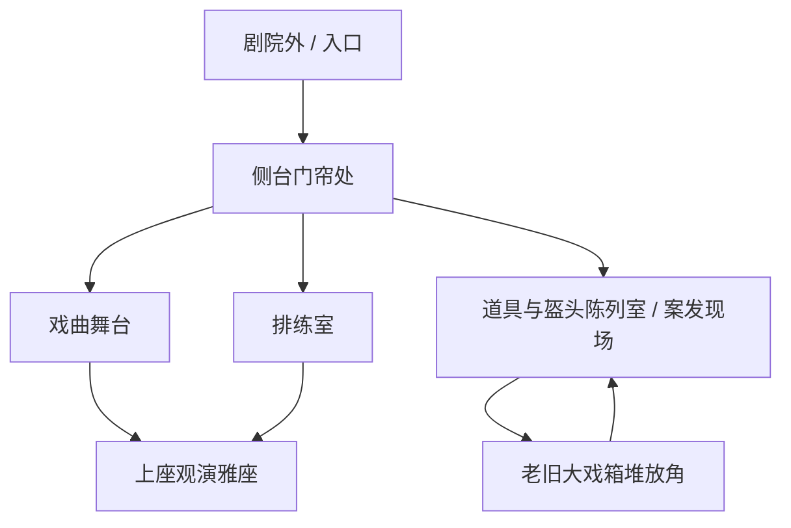

# 《画皮》第一天完整版：剧情与解密关卡设计

版本定位：第一天白天完整可玩闭环。现代社会、本格推理、民国旧案重演。  
目标体验：像《弹丸论破》的案发现场侦察，但谜题节奏参考《纸嫁衣》：玩家在多个场景之间移动，观察图像细节，解开机关，证据进入背包，最后用证据条进行第一次推理判定。

## 0. 第一日核心目标

第一天不是夜晚演出，也不是简单点线索。它要完成四件事：

1. 玩家身份成立：你是民俗犯罪顾问，私下是受匿名短信请来的侦探。
2. 案件成立：现代薛氏剧团复排民国旧戏《断面》，净角钟铁面在后台倒下，现场被伪装成民国旧案重演。
3. 玩法成立：玩家要在场景内点击人物和器物，通过谜题获得证据，而不是靠字条直接给答案。
4. 推理成立：第一天结尾玩家不抓真凶，只证明“这不是诅咒，是人为复刻旧案”。

## 1. 可用素材与场景分区

### 场景地图

### 场景功能

| 场景 | 功能 | 第一日可发现内容 |
|---|---|---|
| 剧院外 / 入口 | 开场 intro、自言自语、接匿名委托 | 匿名短信、旧戏院外观、玩家身份 |
| 侧台门帘处 | 地图中转、第一次听见锣声 | 幕布细线、侧门方向、阿喜站位 |
| 排练室 | 人物盘问、锣鼓谱谜题前置 | 公告板、座位表、茶杯顺序、薛万山站位 |
| 戏曲舞台 | 锣鼓机关、灯光/幕布视觉 | 旧唱机、锣鼓台、舞台幕布 |
| 道具与盔头陈列室 | 案发现场主场景 | 倒地位置、脸谱盒、门闩、药瓶、沈青衣站位 |
| 老旧大戏箱堆放角 | 戏箱封条小谜题 | 残缺戏单、旧票根、民国旧照 |
| 上座观演雅座 | 反锁诡计关键点 | 铜环、细线方向、俯视舞台与侧门 |

## 2. 第一日剧情流程

### 2.1 Intro：剧院外

画面：现代傍晚，旧剧院外。招牌灯半亮，门口没有 NPC，只做背景氛围。  
UI：中央字幕，不压上下边，按钮只有“继续 / 跳过”。

独白：

> 我第一次来薛氏剧团，是以“民俗犯罪顾问”的身份。
>
> 这个身份好用。警察不方便问的旧事，剧团的人会说成传闻；剧团不愿承认的事故，媒体会写成怪谈。
>
> 真正让我来的，是一条没有署名的短信。
>
> “今晚复排《断面》。别让民国那场火，再烧一次。”
>
> 民国二十三年，同一座戏院，同一出戏。锣点提前，后台起火，青衣失踪，净角背罪。
>
> 九十三年后，旧戏重排。有人把历史搬回了舞台。

触发：玩家点击继续后进入“侧台门帘处”。

### 2.2 进入后台：侧台门帘处

场景内人物：阿喜站在门帘边，玩家可点击他对话。  
首次进入先播放短剧情：

> 门帘后传来一声短锣。
>
> 那一声不在排练节拍里，像有人故意敲给我听。
>
> 阿喜从门帘里探出半张脸，笑得很快：“顾问先生，您来得巧。后台今天不太干净。”

阿喜对话第一轮：

阿喜：
> 我就是打杂的，搬箱、倒水、看门，哪样都沾一点。
>
> 钟爷刚刚还骂我，说我把锣槌搁错了。结果锣一响，人就倒了。
>
> 您别看我，我胆小，真出事我比谁跑得都快。

玩家可问：

- “锣是谁敲的？”
- “你碰过谁的杯子？”
- “侧门是谁锁的？”

第一轮阿喜不给关键答案，只开放排练室和案发现场。

### 2.3 案发触发：道具与盔头陈列室

进入案发现场时：

> 钟铁面倒在盔头架前，半张烧焦脸谱扣在脸侧。
>
> 没有火。没有烟。只有一点新香灰的味道。
>
> 旁边有人低声说：和民国那晚一样。

沈青衣站在场景左侧，玩家可以点击她；钟铁面不做可对话角色，只做现场视觉核心。

沈青衣第一轮对话：

沈青衣：
> 别碰那张脸谱。
>
> 民国那年，失踪的青衣也戴过类似的妆。可这不是旧物，旧物不会有新香灰的味道。
>
> 我不信鬼。鬼不会知道今天谁负责喝水，谁负责上场，谁有钥匙。

玩家可问：

- “你为什么知道旧案细节？”
- “钟铁面今天和谁吵过？”
- “脸谱是谁摆的？”

沈青衣答复方向：她知道旧案，但不承认身份；提示玩家先看“脸谱盒”和“药瓶”。

## 3. 第一日谜题链

第一天做 5 个主谜题 + 1 个最终判定。所有谜题都产出证据条。错误操作扣心，但不会卡死；扣心后给含蓄提示。

### 谜题 1：脸谱五色

场景：道具与盔头陈列室。  
前置：点击脸谱盒。  
视觉：不要做字条提示，画面里要有五张脸谱、旧戏单残页、架子上行当顺序暗示。

玩家看到：

- 脸谱盒上有五个凹槽。
- 残缺戏单写着“生、旦、净、丑”，但“生”字被烧掉一半。
- 旧照里白脸没有站在台前，而是在幕布后。

操作：

玩家依次点击五色脸谱按钮或拖入凹槽。

正确顺序：

红 → 金 → 黑 → 蓝 → 白

设计逻辑：

- 红：生角戏服主色。
- 金：旦角凤冠残金。
- 黑：净角黑面。
- 蓝：丑角蓝边帽。
- 白：幕后白脸，最后放。

成功产出：

- 证据条：新鲜香灰
- 道具：旧戏票残页
- 剧情：脸谱盒夹层弹开，里面不是民国旧物，而是现代香灰和新烧过的票边。

失败提示：

> 站在台前的人，不一定最先出场。

### 谜题 2：润喉药瓶

场景：排练室 + 案发现场。  
前置：调查案发现场药瓶后，去排练室查看茶桌。

玩家看到：

- 排练室桌上三只杯子，杯底残渍不同。
- 座位表写着：钟铁面靠近锣鼓板，沈青衣靠镜墙，阿喜没有固定座位。
- 药瓶标签“护嗓丸”贴歪，边缘露出另一层标签。

操作：

玩家需要把三只杯子和座位表拖线对应：

- 铜边杯 → 钟铁面
- 白瓷杯 → 沈青衣
- 玻璃杯 → 薛万山

然后用“旧戏票残页”刮开药瓶标签，露出“镇静药粉”。

正确解法：

选择“铜边杯 + 护嗓药瓶 + 钟铁面座位”。

成功产出：

- 证据条：嗓子药瓶
- 证据描述：钟铁面倒下前摄入镇静药，凶手不需要当场重击。

失败提示：

> 杯子不是看谁拿过，而是看谁最后必须喝。

### 谜题 3：错位锣点

场景：排练室 + 戏曲舞台。  
前置：获得“嗓子药瓶”后，薛万山出现在排练室。

薛万山对话：

> 顾问先生，后台出事，我比谁都急。
>
> 但锣鼓点是排好的，演员跟锣走，没人会乱敲。
>
> 除非有人想让大家都以为，那一声本来就该响。

玩家看到：

- 排练室公告板有今日锣鼓谱。
- 舞台边旧唱机反复播放一段练功节拍。
- 案发时众人都听见“短锣”，但没人听见倒地声。

操作：

在舞台锣鼓台输入五拍节奏。  
按钮：慢、急、停。  
正确输入：慢 → 急 → 停 → 急 → 慢

解法来源：

公告板写的是“慢、急、急、停、慢”，旧唱机实际少一拍，说明第三拍被提前，倒地声被第四拍盖住。

成功产出：

- 证据条：错位锣点
- 场景变化：舞台幕布轻晃，露出滑轨细线的一段。

失败提示：

> 不是哪一拍错了，是哪一拍替别人说了话。

### 谜题 4：反扣门闩

场景：侧台门帘处 + 上座观演雅座 + 案发现场。  
前置：完成错位锣点后可调查幕布细线。

玩家看到：

- 案发现场侧门门闩像从屋内扣上。
- 门外地面有木屑。
- 雅座扶手上有一个铜环，角度正对滑轨。
- 侧台幕布边缘有磨损线痕。

操作：

做一个简易拖线谜题：玩家把“细线”从雅座铜环拉到滑轨，再拉到侧门门闩。  
路线必须经过三个节点：

雅座铜环 → 幕布滑轨 → 侧门门闩

成功产出：

- 证据条：门外反锁复原图
- 证据描述：凶手可在门外制造屋内反锁假象。

失败提示：

> 线不能穿墙，只能借戏台上的东西转弯。

### 谜题 5：戏箱封条

场景：老旧大戏箱堆放角。  
前置：获得“门外反锁复原图”后，阿喜承认自己曾搬过旧戏箱。

阿喜第二轮对话：

> 我是搬过箱子，但箱子上封条都旧了，谁敢乱开？
>
> 班主说那里面是民国留下来的晦气东西，碰了要赔命。
>
> 可我看见有一条封条是新糊的，浆糊都没干透。

玩家看到：

- 四个戏箱贴着“生、旦、净、丑”。
- 封条年份为：民国二十三年、民国二十四年、2001、今日。
- 今日封条贴在“净”箱上，但箱内残页属于“旦”。

操作：

玩家需要按旧照站位重新排列四个箱签：

旦 → 净 → 丑 → 生

然后把“旧戏票残页”放进“旦”箱缺口，打开夹层。

成功产出：

- 证据条：旧案戏票
- 道具：民国旧照背面
- 剧情信息：民国旧案并非单纯火灾，当年有人把青衣身份从记录里抹掉。

失败提示：

> 现在贴着什么，不代表当年装着什么。

## 4. 人物在场景内的站位与对话推进

### 沈青衣

初始位置：道具与盔头陈列室左侧，靠近脸谱架。  
作用：提供旧案知识，但隐藏自己与失踪青衣后人的关系。  
对话深度分三段：

第一段，未解脸谱：
> 旧案里最吓人的不是火，是所有人都说自己没看见。

第二段，解开脸谱后：
> 这香灰太新了。有人想让你闻到“旧案”的味道，可他忘了，旧东西不会这么热。

第三段，获得旧案戏票后：
> 如果你见到票背上的名字，别当着班主念出来。薛家的人最怕那个名字重新站到台上。

### 阿喜

初始位置：侧台门帘处。  
作用：误导嫌疑人、搬箱线索、钥匙线索。  
对话深度分三段：

第一段，案发前后：
> 我胆小，真出事我跑得比谁都快。可今天不一样，门帘像有人从后面拉着。

第二段，完成反扣门闩后：
> 那条线我见过！吊景师傅以前拿它拉幕，后来不用了，就缠在雅座栏杆底下。

第三段，戏箱封条前：
> 我偷懒归偷懒，杀人这种事别扣我头上。真要说谁能动封条，只有拿账本的人。

### 薛万山

初始位置：排练室右侧，完成药瓶谜题后出现。  
作用：掌握权限，不直接露馅。  
对话深度分三段：

第一段：
> 我请你来，是希望你压住传闻，不是让你把剧团拆开看。

第二段，完成锣点谜题后：
> 锣鼓错一拍，演员就会乱。可有些错，是为了让所有人同时闭嘴。

第三段，第一日结尾：
> 你证明这不是鬼，那很好。可你还没证明是谁让鬼站上台。

## 5. 第一日最终判定

触发条件：

- 获得“新鲜香灰”
- 获得“嗓子药瓶”
- 获得“错位锣点”
- 获得“门外反锁复原图”
- 获得“旧案戏票”

判定题：

> 钟铁面倒下后，为什么现场会被所有人认作“民国旧案重演”？

玩家需要按顺序提交证据条：

1. 嗓子药瓶：钟铁面先被药物削弱。
2. 错位锣点：倒地声被提前锣点遮蔽。
3. 门外反锁复原图：凶手制造屋内反锁假象。
4. 新鲜香灰：烧焦脸谱与香灰是现代伪装。
5. 旧案戏票：凶手故意把现代案嫁接到民国旧案。

正确结论：

> 这不是旧案自己重演，而是有人按照旧案的外形重新布置现场。  
> 他需要排练表、道具权限、旧案资料和后台路线。  
> 第一日不能定凶，但嫌疑范围从“所有演员”缩小到“能接触排练流程和旧戏箱的人”。

错误提交扣心逻辑：

| 错误类型 | 扣心提示 |
|---|---|
| 只提交旧戏票 | 你证明了旧案关联，但没有证明现代手法。 |
| 先提交香灰 | 伪装是结果，不是作案开始。 |
| 忽略药瓶 | 如果钟铁面没有先失力，反锁诡计没有意义。 |
| 忽略锣点 | 没有声音遮蔽，所有人都会听见倒地。 |
| 忽略门闩 | 你还没解释“密室”为什么成立。 |

## 6. 第一日结尾剧情

判定成功后：

> 我把五条证据摆在桌上。
>
> 药瓶解释了钟铁面为什么倒下。锣点解释了为什么没人听见。细线解释了反锁。香灰解释了旧案气味。戏票解释了为什么所有人第一时间想到民国。
>
> 历史没有重演。
>
> 有人把历史排练了一遍。

沈青衣：
> 你现在知道了吧？旧案不是传闻，是剧团每个人都绕着走的一根钉子。

阿喜：
> 那今晚还演吗？钟爷都这样了，还演个什么？

薛万山：
> 演。票已经卖了，媒体也到了。越是出事，越不能停。

最后镜头：

舞台幕布后传来旧唱机声，播放的不是今日锣点，而是民国二十三年的《断面》开场。  
玩家获得新目标：

> 夜晚复排前，查清“当年失踪青衣”的名字。

第一天结束，不进入夜晚案发，只留下第二天/后续目标。

## 7. UI 和实现要求

1. 人物必须放在场景内，点击人物进入对话，不要单独列表。
2. 对话界面必须保留当前场景背景，并显示角色立绘、姓名、底部对话框。
3. 搜索界面不能只放文字按钮，按钮应覆盖在可观察物体上；提示字条只作为辅助 UI。
4. 线索栏默认收起，玩家点击“线索 C”后展开证据条。
5. 方向键 UI 使用十字布局，同时键盘方向键可切换场景。
6. 所有字幕区域必须避开顶部状态栏和底部按钮，正文居中，至少保留 90px 上下安全边距。
7. 心数使用图案化 UI，默认 5 心；谜题错误或判定错误扣 1 心。

## 8. 两天制作优先级

必须完成：

- Intro 到侧台门帘处。
- 场景地图与方向键切换。
- 场景内人物点击对话。
- 脸谱五色、润喉药瓶、错位锣点三个可操作谜题。
- 第一日最终判定。

尽量完成：

- 反扣门闩拖线谜题。
- 戏箱封条排序谜题。
- 第一日结尾剧情。

可以用简化 UI 临时代替：

- 拖线谜题可以先用三个节点按钮代替。
- 杯子对应可以先用三选一按钮代替。
- 戏箱排序可以先用顺序输入代替。

